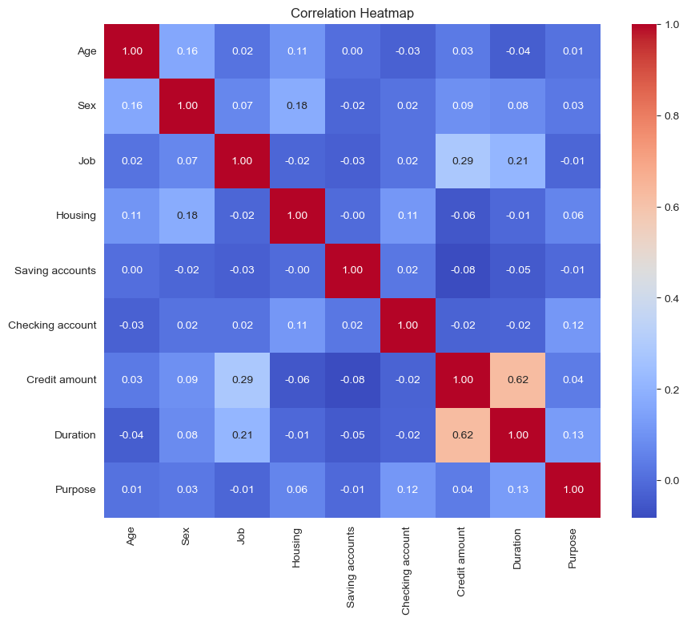

# Loan Insights Analysis 

## Table of Contents  
1. [Abstract](#abstract)  
2. [Dataset Overview](#dataset-overview)  
3. [Preprocessing Phase](#preprocessing-phase)  
   - [One-Hot Encodings](#one-hot-encodings)  
   - [Mappings](#mappings)  
   - [Filling Missing Values](#filling-missing-values)  
   - [Reverse Mappings](#reverse-mappings)  
4. [Visualization Phase](#visualization-phase)  
   - [Parallel Plots](#parallel-plots)  
   - [Correlation Heatmaps](#correlation-heatmaps)  
   - [Pairwise Comparison](#pairwise-comparison)  
   - [Histograms](#histograms)  
   - [Box Plots](#box-plots)  
5. [Results and Insights](#results-and-insights)  

## Abstract  
This project analyzes a German bank's loan dataset with the goal of extracting valuable insights through data visualization techniques. The dataset contains diverse features, including demographic and financial information about loan applicants, such as age, gender, job status, housing situation, account balances, loan amount, loan duration, and loan purpose. By applying various visualization methods, such as correlation heatmaps, pairwise comparisons, histograms, and box plots, the project aims to identify patterns, relationships, and trends in the data. The insights gained will help in understanding how different factors influence loan approvals and applicant profiles, and provide a clearer picture of the bank's customer base and loan application trends.

---

## Dataset Overview

This dataset contains information related to individuals applying for loans. The data includes various demographic and financial features that describe the applicant's background, loan request, and financial situation. The features are as follows:

- **Age**: Represents the individual's age.
- **Sex**: Indicates the individual's gender.
- **Job**: Denotes the individual's skill level or job status:
  - 0: No skills or unemployed
  - 1: Skilled and employed
  - 2: Highly skilled
  - 3: Very highly skilled
- **Housing**: Shows the individual's housing situation:
  - "own"
  - "rent"
  - "free"
- **Saving Account**: Indicates the saving account status:
  - "little"
  - "moderate"
  - "quite rich"
  - "rich"
- **Checking Account**: Indicates the checking account status:
  - "little"
  - "moderate"
  - "quite rich"
  - "rich"
- **Credit Amount**: Specifies the loan amount requested by the individual.
- **Duration**: Represents the loan repayment period in months.
- **Purpose**: Describes the reason for taking the loan. The options include:
  - "car"
  - "furniture/equipment"
  - "radio/TV"
  - "domestic appliances"
  - "repairs"
  - "education"
  - "business"
  - "vacation/others"

## Preprocessing Phase  
These are the steps done for PreProcessing phase, which is done in `rea_data.ipynb` file:  
1. **One-Hot Encodings**: applying one-hat encoding one `sex`, `housing`, `purpose` features.
2. **Mappings**: applying mapping on `saving_accounts`, `checking_accounts` features.  
3. **Filling Missing Values**: filling missing values of `saving` and `checking` accounts by RandomForest Classifier.  
4. **Reverse Mappings**: reverse mapping is applied to all features to make results interpretable.  

## Visualization Phase  
Various visualization methods are used in this section to extract insights from different features,  
 visualization phase is done in `visualization.ipynb`:  
1. **Parallel Plots**: features like: `sex`, `housing` and `purpose` are visualized in this section.
2. **Correlation Heatmaps**: Correlation is done over all features, some features are highly correlated and some not.  
3. **Pairwise Comparison**: Like correlation heatmap pairwise comparison is also done overall features.  
4. **Histograms**: Histogram plot is used for following features: `Age`, `Sex`, `Job`, `Housing`, `Credit Amount`, `Purpose`.  
5. **Box Plots**: Also we have used Box-Plot for following features: `Age`, `Sex`, `Job`, `Savings`, `Purpose`.  

## Results and Insights:
1. **Parallel Plot For Sex:**
- Most high paid jobs belong to men.
- Women appear to not own houses as much as men.
- Women tend to have higher amounts in saving and checking account than men.
- Women tend to spend more on furniture/equipment, radio/TV, domestic appliances and vacation/others.

 

---

2. **Correlation Heatmap:**

- **Most Correlated Pairs:**
  - Sex vs. Housing: Men are more likely to own houses than women, likely reflecting traditional socio-economic patterns.
  - Job vs. Credit Amount: Higher job categories and income are associated with higher credit amounts, as stable employment increases creditworthiness.

- **Not Correlated at All:**
  - Age vs. Checking Account: Checking account usage doesn't vary significantly by age, indicating similar habits across age groups.
  - Age vs. Duration: Loan duration isn’t significantly influenced by age, suggesting factors like income and job security play a larger role.

---

3. **Histograms:**

- Most loan requesters had skilled jobs.

- Most loan requesters already owned a house.

- Most loan requests were below 10k, maybe applying 10k limit to loans to provide loans for more people.

- Car and radio/TV are the most picked purposes for loans.

---

4. **Box Plot Age:**

- Young People and Higher Loans:  
  Younger individuals tend to receive higher loan amounts.

- Young People and Loan Duration:  
  Younger people are more likely to secure loans with longer durations.

- Business Loans by Older People:  
  Older individuals tend to request business loans more frequently.

- Age 19-34 and 52-62 and Savings:  
  People aged 19-34 and 52-62 tend to have higher savings compared to other age groups.

- Age 24-40 and Checking Accounts:  
  Younger individuals, primarily aged 24-40, have higher checking account balances than others.

